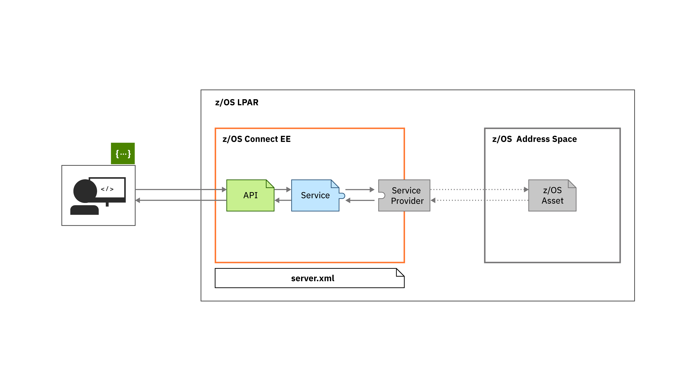

# z/OS Connect Enterprise Edition Sample Service Provider

In this code, we show how to create a Service Provider for z/OS Connect Enterprise Edition (EE). A service provider is the mechanism by which z/OS resources can be made available to be made available as RESTful APIs through z/OS Connect EE.

## Scenario

Data records are stored in a document database, which need to be included into new RESTful APIs hosted in z/OS Connect EE. Creating a service provider allows the documents in a specific table to be made available to the API developer for inclusion in the API.

### 1. Identify the resources to make available

Identifying the resources to make available is the most important step of designing your service provider. It is best to try to expose a specific resource through a service. Our service provider might decide to expose the entire database as a service, but then the API developer needs to specify the table and deal with the differing record structures that each table can contain. It is better to expose a single table as a service that contains a single record type and then have multiple services if there are multiple tables that need to be included in the APIs.

### 2. Produce schemas for the service

A z/OS Connect EE service is designed to accept and produce a JSON object. The structure of the input and output is defined by a JSON schema that is contained in the SAR file and available at from the z/OS Connect EE server by using a REST call. How these schemas are added to the SAR is defined as part of the SAR creation.

### 3. Define the service configuration

The schemas are not the only pieces of information that a service will need when invoked, the database table will be defined in the SAR as well.

The database connection configuration is not stored in the SAR file. This design decision is to allow the same SAR file to be deployed into different environments with different copies of the database without having to rebuild the SAR file.

Building the SAR file is covered in 

`TODO link to SAR plugin repo`

### 4. Create the service provider code

The service provider needs to provide implementations of two interfaces that are defined in the z/OS Connect EE SPI. These interfaces are

- [ServiceFactory](https://www.ibm.com/support/knowledgecenter/SS4SVW_3.0.0/com.ibm.zosconnect.doc/javadoc/com/ibm/zosconnect/spi/ServiceFactory.html) - An OSGi service that will process the SARs for this Service Provider.
- [ServiceController](https://www.ibm.com/support/knowledgecenter/SS4SVW_3.0.0/com.ibm.zosconnect.doc/javadoc/com/ibm/zosconnect/spi/ServiceController.html) - Instances of this class will represent the services in the z/OS Connect EE server.

#### 4.1 Creating a ServiceFactory

The ServiceFactory interface defines methods that will be called in relation to changes in a SAR file.

##### getProvider

This method is called when the ServiceFactory is registered and returns the provider name that SARs for this ServiceFactory will contain. It is used by the z/OS Connect Server to ensure the correct SARs are sent to this ServiceFactory.

##### registerService

This method is called when a SAR file is newly made available to the z/OS Connect EE server. The contents of the SAR file are available in the SarFile object and any configuration-based overrides are available in the Properties Object passed in as parameters to this function.

When called this method will:

1. Check the contents of the SAR file to make sure they're still valid.
1. Create an instance of the ServiceController to represent the service and set the configuration appropriately.
1. Register the ServiceController instance with the OSGi registry to install the service.

##### updateService

This method is called when a SAR file for a currently installed service is modified and the server is notified of the change.

When called this method will:

1. Locate the ServiceController instance for the SAR file to be updated.
1. Update the configuration in that Object.

##### deregisterService

This method is called when a SAR file is removed and the server is notified of the change.

When called this method will:

1. Unregister the ServiceController that represents the Service.
1. Clean up any other resources that are associated with the Service.

#### 4.2 Creating a ServiceController

An instance of the ServiceController represents the service that was defined in the SAR file. The required methods are implemented as follows:

##### getProviderName

Return the provider name. This will match the name returned from the `ServiceFactory`.

##### getRequestSchema

Return the JSON schema that describes the structure of requests to this service. This will be returned to any user that makes a REST call to retrieve the request schema for this service.

##### getResponseSchema

Return the JSON schema that describes the structure of responses from this service. This will be returned to any user that makes a REST call to retireve the response schema for this service.

##### status

Return the current status of this service. This will be included in the information returned to the user about the service.

##### start

Change the service status to `Started` along with any other processing that is required to start the service.

##### stop

Change the service status to `Stopped` along with any other processing that is required to stop the service.

##### invoke

Takes the input from the client or the API, calls the system of record and then returns the response JSON object.

Dealing with errors

Transforming data

##### getStatistics

This method allows the service to report any statistics back through the z/OS Connect administration API. The information and the format used is left to the Service Provider implementer to determine what is appropriate based on the implementation. This method is optional and so can be left to return null if required.